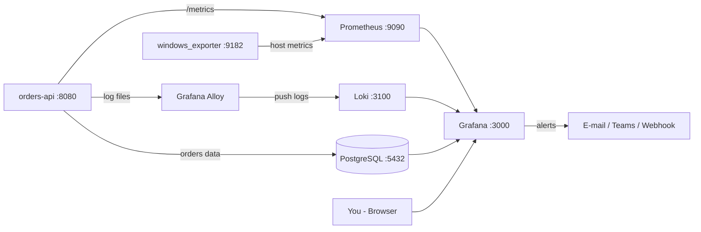

# Grafana: Dashboards, Observability & Alerting

## Day 0 – Course Introduction & Participant Guide

Welcome to the course. Read this file **before Day 1**. It covers:

- what the course covers
- how the course files are organised
- what to prepare
- how each day will run

---

## Contents

1. [Course Details](#1-course-details)
2. [How to Use This Courseware](#2-how-to-use-this-courseware)
3. [Prerequisites & Self-Check](#3-prerequisites--self-check)
4. [Lab Setup Requirements](#4-lab-setup-requirements)
5. [Learning Objectives](#5-learning-objectives)
6. [Training Delivery Schedule](#6-training-delivery-schedule)
7. [A Typical Training Day](#7-a-typical-training-day)
8. [Lab Architecture](#8-lab-architecture)
9. [Lab Folder Layout & Conventions](#9-lab-folder-layout--conventions)
10. [Pre-Training Validation Checklist](#10-pre-training-validation-checklist)
11. [Key Terms You Will Meet](#11-key-terms-you-will-meet)
12. [Day 0 Quiz](#12-day-0-quiz)
13. [Getting Help During the Course](#13-getting-help-during-the-course)

---

## 1. Course Details

| Item | Details |
|---|---|
| Course | Grafana: Dashboards, Observability & Alerting |
| Client | PwC |
| Vendor | TSE |
| Trainer | Vaman Rao Deshmukh |
| Mode | VILT (virtual instructor-led) |
| Dates | To be confirmed |
| Duration | Five days |
| Daily timing | 9:30 AM to 5:30 PM IST |
| Audience | Specific project team |
| Approach | Hands-on (~70% labs), industry-standard, enterprise-focused |
| Grafana version | Grafana OSS 12.x (exact versions of all components are pinned in the lab repository) |

> **Note:** Some items may change after the connect call with the project team. These include:
> - the Day 4 track
> - lab options
> - the capstone scenario
>
> If anything changes, the affected day files will be updated before that day.

---

## 2. How to Use This Courseware

### 2.1 Course files

The courseware is a set of Markdown files, one per day:

| File | Day | Title |
|---|---|---|
| `day00-intro.md` | Before Day 1 | Course introduction & participant guide (this file) |
| `day01-observability-setup-datasources.md` | Day 1 | Observability, Grafana Setup & Data Sources |
| `day02-dashboards-querying.md` | Day 2 | Dashboards & Querying |
| `day03-dynamic-dashboards-alerting.md` | Day 3 | Dynamic Dashboards & Alerting |
| `day04-logs-traces.md` | Day 4 | Project-Specific Advanced Track (default: Logs & Traces) |
| `day05-admin-automation-capstone.md` | Day 5 | Administration, Automation & Capstone |

Config files, sample data and scripts used in the labs are in the **GitHub lab repository**. The link will be shared before the training.

### 2.2 Structure of every day file

Each day file (Day 1 to Day 5) has the same sections, so you always know where to look:

| Section | What it contains |
|---|---|
| **Learning Goals** | What you will be able to do by the end of the day |
| **Concepts** | Topic-wise explanation with diagrams, examples and queries |
| **Labs** | Step-by-step, numbered lab instructions with expected results |
| **Exercises** | Practice tasks without step-by-step help, to test your understanding |
| **Troubleshooting** | Common errors, their causes and fixes |
| **Quiz** | 10–15 questions to check your learning |
| **Summary & Cheat Sheet** | Key points and a quick reference of queries and commands |
| **Answers** | Quiz answers and exercise hints, in collapsible blocks at the end |

### 2.3 Suggested way to study

1. **Before each day:** skim that day's *Learning Goals* and *Concepts* sections (about 15 minutes).
2. **During the day:** follow the trainer and complete every lab. Labs build on each other, so don't skip them.
3. **After the day:**
   - Attempt the *Exercises* and the *Quiz*.
   - Only then open the answers.
   - Note your doubts for the next morning's recap.
4. **After the course:** use the *Summary & Cheat Sheet* sections as a quick reference at work.

---

## 3. Prerequisites & Self-Check

### 3.1 Required

- **Basic SQL:** `SELECT`, `WHERE`, `GROUP BY`
- **Networking basics:** IP address, ports, HTTP

### 3.2 Recommended

- General monitoring concepts: CPU, memory, response time, error rate
- Comfort with Windows Command Prompt / PowerShell
- Reading YAML / JSON files
- Git basics

### 3.3 Prerequisite self-check

Try these before Day 1. If more than two feel unfamiliar, spend 30–60 minutes on a quick refresher.

**SQL.** What does this query return?

```sql
SELECT status, COUNT(*) AS total
FROM orders
WHERE created_at >= '2026-01-01'
GROUP BY status;
```

**Networking.** Look at the URL `http://localhost:9090/metrics`. Which part is:

- the protocol?
- the host?
- the port?
- the path?

**YAML.** In the snippet below:

- How many scrape jobs are defined?
- What is the scrape interval?

```yaml
global:
  scrape_interval: 15s
scrape_configs:
  - job_name: prometheus
    static_configs:
      - targets: ["localhost:9090"]
  - job_name: windows
    static_configs:
      - targets: ["localhost:9182"]
```

**JSON.** In the object below, what is the value of `panels[0].type`?

```json
{ "title": "Host Overview", "panels": [ { "type": "timeseries", "title": "CPU" } ] }
```

**PowerShell.** Which command checks whether something is listening on port 3000?

<details>
<summary>Self-check answers</summary>

- **SQL:** One row per order `status`, with the count of orders created on or after 1 Jan 2026.
- **URL:**
  - Protocol: `http`
  - Host: `localhost`
  - Port: `9090`
  - Path: `/metrics`
- **YAML:** Two jobs (`prometheus`, `windows`). The scrape interval is 15 seconds.
- **JSON:** `"timeseries"`
- **PowerShell:** `Test-NetConnection localhost -Port 3000` or `netstat -ano | findstr :3000`

</details>

---

## 4. Lab Setup Requirements

### 4.1 Hardware

- Windows 11 PC, 64-bit, 4+ core CPU (minimum Intel i5 or equivalent)
- 16 GB RAM recommended (8 GB minimum)
- 30 GB free disk space
- Internet connection of at least 100 Mbps

### 4.2 Software

- Windows 11 with local admin rights, or the software below pre-installed by IT
- Lab stack, installed natively on Windows:

| Component | Role in the lab | Default port |
|---|---|---|
| Grafana OSS | Visualisation, dashboards, alerting | 3000 |
| Prometheus | Metrics storage and querying | 9090 |
| windows_exporter | Windows host metrics (CPU, memory, disk, network) | 9182 |
| Loki | Log storage and querying | 3100 |
| Grafana Alloy | Collector for logs (and later traces) | 12345 (UI) |
| PostgreSQL | Relational data for SQL dashboards | 5432 |
| Sample application (`orders-api`, Node.js + Express) | Generates metrics, logs, DB records (and traces on Day 4) | 8080 |

- **Node.js LTS (24.x)**, to run the sample application (the portable ZIP works without admin rights)
- VS Code (recommended) or Notepad++
- Git for Windows
- Latest Chrome / Edge
- Terraform CLI (optional, for Day 5)
- MS Teams / Zoom / Webex, as used by the client

> **Note:** Installers, config files and a step-by-step setup guide will be shared before the training. Detailed installation steps are also covered in **Day 1, Lab 1**.

### 4.3 Permissions and network

- Access to `grafana.com`, `github.com`, `postgresql.org` and `nodejs.org` for downloads
- Access to `registry.npmjs.org`, so `npm install` can fetch the sample application's packages (or a corporate npm proxy)
- Windows Firewall must allow these local ports: **3000, 9090, 9182, 3100, 5432, 8080**
- Additional local ports used on Day 4 (tracing) will be listed in the Day 4 file

### 4.4 Alternatives (to be discussed)

**Grafana Cloud free tier** can be used:

- for Day 4 tracing, or
- as a fallback if local installs are restricted on your machine.

---

## 5. Learning Objectives

By the end of this training, you will be able to:

- Understand observability concepts and where Grafana fits in a monitoring stack
- Install, configure and administer Grafana and connect common data sources
- Build clear, reusable, production-grade dashboards
- Write queries in PromQL, SQL and LogQL, and troubleshoot using Explore
- Build dynamic dashboards with variables, transformations and drill-downs
- Configure Grafana Alerting end to end
- Manage users, permissions and authentication
- Manage dashboards, data sources and alerts as code

---

## 6. Training Delivery Schedule

### Day 1 – Observability, Grafana Setup & Data Sources

**File:** `day01-observability-setup-datasources.md`

**Topics:**
- Monitoring vs observability; metrics, logs and traces
- Golden Signals, RED and USE methods
- Grafana architecture; editions: OSS, Enterprise, Cloud
- Installing Grafana on Windows; overview of Linux, Docker and Kubernetes deployments
- Configuration (`custom.ini`), server log, UI tour
- Data sources: Prometheus, Loki, PostgreSQL / MySQL
- Overview: Azure Monitor, CloudWatch, Elasticsearch, InfluxDB, REST / CSV

**Labs:**
- Set up the Windows lab stack
- Connect data sources
- Import and study a community dashboard

### Day 2 – Dashboards & Querying

**File:** `day02-dashboards-querying.md`

**Topics:**
- Dashboard structure: panels, rows, layout, time range
- Visualizations: Time series, Stat, Gauge, Table, Bar, Pie, Heatmap, State timeline, Logs
- Units, thresholds, value mappings, overrides
- Dashboard versions and JSON model
- PromQL: rate, aggregations, percentiles
- SQL in Grafana: `$__timeFilter`, `$__timeGroup` macros
- LogQL basics
- Explore and Drilldown apps

**Labs:**
- Build a Windows host monitoring dashboard (CPU, memory, disk, network)
- Build an application (RED) dashboard from PromQL, SQL and log queries

### Day 3 – Dynamic Dashboards & Alerting

**File:** `day03-dynamic-dashboards-alerting.md`

**Topics:**
- Variables: query, custom, interval, chained, multi-value
- Repeating panels and rows
- Transformations and library panels
- Annotations and drill-down links
- Grafana Alerting: alert rules, expressions, evaluation groups
- Contact points: e-mail, MS Teams, Slack, webhook
- Notification policies, templates, silences, mute timings
- Alerting best practices

**Labs:**
- Build a reusable variable-driven dashboard
- Create severity-based alerts with routing and custom templates
- Trigger and validate alerts

### Day 4 – Project-Specific Advanced Track (to be discussed)

**File:** `day04-logs-traces.md` (default track)

**Default track: Logs & Traces**
- Loki and Grafana Alloy: log collection and labels
- Advanced LogQL and log-based alerts
- OpenTelemetry basics; Tempo and TraceQL
- Correlating metrics, logs and traces

**Alternative tracks** (to be chosen after the connect call):
- Kubernetes & cloud monitoring
- Business / SQL reporting dashboards
- Enterprise & Cloud features (RBAC, reporting, enterprise data sources)
- Custom mix as per project needs

**Labs:**
- Build a log pipeline and log-based alerts
- Trace a slow request from metric to logs to trace

> If an alternative track is chosen, the Day 4 file name and content will change. The track name will be reflected in the file name.

### Day 5 – Administration, Automation & Capstone

**File:** `day05-admin-automation-capstone.md`

**Topics:**
- Users, teams, roles, folder permissions
- Authentication: LDAP, OAuth / Entra ID, SAML (overview)
- Service accounts and sharing
- Provisioning via YAML files
- HTTP API (PowerShell) and Terraform
- Version control of dashboards with Git
- Best practices: dashboard design, query performance, backup, upgrades

**Capstone project:**
1. Configure data sources for metrics, logs and SQL
2. Build overview and detail dashboards with variables and drill-downs
3. Define alert rules with routing and notification templates
4. Provision dashboards and data sources from files
5. Simulate a failure scenario and validate alerts
6. Demo and review

### How the days build on each other

```
Day 1  Stack + data sources ──►  Day 2  Dashboards + queries ──►  Day 3  Variables + alerts
                                                                          │
Day 5  Admin + as-code + capstone  ◄──  Day 4  Logs, traces, correlation ◄┘
```

Each day reuses the lab stack and dashboards from the previous day. **Do not uninstall or reset anything between days.**

---

## 7. A Typical Training Day

| Time (IST) | Session |
|---|---|
| 9:30 – 9:45 | Recap of previous day, doubt clearing |
| 9:45 – 11:15 | Concepts + guided demo |
| 11:15 – 11:30 | Break |
| 11:30 – 1:00 | Lab block 1 |
| 1:00 – 1:45 | Lunch |
| 1:45 – 3:30 | Concepts + lab block 2 |
| 3:30 – 3:45 | Break |
| 3:45 – 5:15 | Lab block 3 / exercises |
| 5:15 – 5:30 | Day summary, quiz, Q&A |

About 70% of the time is hands-on. Keep Grafana and your lab stack running throughout the day.

> **Tip:** On a single-monitor setup, keep the meeting window and your browser side by side. A second monitor makes labs much easier.

---

## 8. Lab Architecture

All components are installed natively on your **Windows 11 PC** and accessed through the browser.



In text form:

```
Sample application ─► windows_exporter ─► Prometheus ─► Loki / Alloy ─► PostgreSQL ─► Grafana
```

- **Metrics path:** the sample app and windows_exporter expose metrics → Prometheus scrapes them → Grafana queries them with **PromQL**.
- **Logs path:** the sample app writes log files → Alloy reads and ships them → Loki stores them → Grafana queries them with **LogQL**.
- **SQL path:** the sample app writes business data (orders) into PostgreSQL → Grafana queries it with **SQL**.
- **Traces path (Day 4):** the sample app sends OpenTelemetry traces to Alloy → Tempo (local or Grafana Cloud) → Grafana queries them with **TraceQL**.

---

## 9. Lab Folder Layout & Conventions

### 9.1 Recommended folder layout

All labs assume this layout. Using the same paths keeps copy-paste commands working.

```
C:\grafana-lab\
├── grafana\             Grafana OSS (conf\custom.ini lives here)
├── prometheus\          prometheus.exe + prometheus.yml
├── windows_exporter\    windows_exporter installer / exe
├── loki\                loki.exe + loki-config.yaml
├── alloy\               Alloy config (config.alloy)
├── sample-app\          orders-api (Node.js + Express) + logs\
├── provisioning\        dashboards & data sources as code (Day 5)
├── dashboards\          exported dashboard JSON files
├── terraform\           Terraform files (Day 5, optional)
├── repo\                clone of the GitHub lab repository
├── start-lab.ps1        starts the lab stack
└── stop-lab.ps1         stops the lab stack
```

### 9.2 Conventions used in the day files

- Commands are **PowerShell** unless marked otherwise. Run PowerShell **as Administrator** when a step says so.
- `code blocks` contain commands, queries or config you can copy.
- Expected results appear after each lab step as **✅ Expected:**.
- Common errors are flagged as **⚠️ Watch out:** and covered in the day's *Troubleshooting* section.
- Default Grafana login is `admin` / `admin`. You will be asked to change the password on first login. Note it down.
- Placeholders are written in angle brackets, e.g. `<your-email>`. Replace them, including the brackets.

---

## 10. Pre-Training Validation Checklist

Complete this **before Day 1** and confirm to the coordinator. Tick each item:

- [ ] Grafana opens at `http://localhost:3000`
- [ ] Prometheus opens at `http://localhost:9090` and shows `windows_exporter` as **UP** (Status → Targets)
- [ ] Loki and PostgreSQL services are running
- [ ] Able to log in to Grafana and add a data source
- [ ] Access to the GitHub lab repository

### Quick verification commands

```powershell
# Check all lab ports are listening
3000, 9090, 9182, 3100, 5432, 8080 | ForEach-Object {
    $r = Test-NetConnection localhost -Port $_ -WarningAction SilentlyContinue
    "{0,-6} {1}" -f $_, ($(if ($r.TcpTestSucceeded) {"OK"} else {"NOT LISTENING"}))
}

# Loki readiness (should return: ready)
Invoke-RestMethod http://localhost:3100/ready

# Prometheus health
Invoke-RestMethod http://localhost:9090/-/healthy

# Grafana health (database should be "ok")
Invoke-RestMethod http://localhost:3000/api/health
```

### If a check fails

| Symptom | Likely cause | What to do |
|---|---|---|
| Port shows NOT LISTENING | Component not started | Run `C:\grafana-lab\start-lab.ps1`. For windows_exporter and PostgreSQL, start the service from `services.msc` |
| Page loads on the same PC but not after restart | Service not set to start automatically | Set startup type to *Automatic* in `services.msc` |
| `windows_exporter` target is DOWN | Wrong target in `prometheus.yml`, or firewall | Check the target is `localhost:9182`; allow the port in the firewall |
| Cannot download installers | Proxy / corporate network block | Ask IT to allow the sites in section 4.3, or use pre-downloaded installers |
| No admin rights | Corporate policy | Request IT to pre-install the stack, or use the Grafana Cloud alternative |

> **Note:** If you cannot complete the checklist, inform the coordinator **at least one day before** the training. Day 1 labs depend on it.

---

## 11. Key Terms You Will Meet

| Term | Meaning |
|---|---|
| **Observability** | The ability to understand a system's internal state from its outputs: metrics, logs and traces |
| **Metric** | A numeric measurement over time, e.g. CPU %, requests per second |
| **Log** | A timestamped text record of an event |
| **Trace** | The end-to-end path of one request across services, made up of *spans* |
| **Data source** | A backend Grafana queries, e.g. Prometheus, Loki, PostgreSQL |
| **Exporter** | A small program that exposes metrics in Prometheus format |
| **Scrape** | Prometheus pulling metrics from a target at a fixed interval |
| **PromQL / LogQL / TraceQL** | Query languages for Prometheus, Loki and Tempo |
| **Label** | A key–value pair identifying a series or log stream, e.g. `job="windows"` |
| **Panel** | A single visualisation on a dashboard |
| **Variable** | A dashboard dropdown that changes queries dynamically |
| **Alert rule** | A query plus a condition that fires when a threshold is breached |
| **Contact point** | Where alert notifications are sent (e-mail, Teams, webhook, …) |
| **Provisioning** | Defining Grafana resources in files so they load automatically |
| **RED method** | Rate, Errors, Duration: for request-driven services |
| **USE method** | Utilisation, Saturation, Errors: for resources like CPU and disk |
| **Golden Signals** | Latency, Traffic, Errors, Saturation |

---

## 12. Day 0 Quiz

A quick warm-up. There's no pressure: these topics are covered in detail from Day 1.

1. Which three signals are commonly called the "pillars" of observability?
2. Which component in our lab **stores** metrics: Grafana or Prometheus?
3. On which port does Grafana run by default?
4. Which query language is used to query Loki?
5. In our lab, which component ships log files into Loki?
6. Is Grafana itself a database? (Yes / No)
7. What does the "R" in the RED method stand for?
8. Which day covers alerting?
9. What is the name of the Day 5 file?
10. You find Prometheus is not showing `windows_exporter` as UP. Name two things you would check.

<details>
<summary>Quiz answers</summary>

1. Metrics, logs and traces
2. Prometheus. Grafana only visualises; it queries data sources.
3. 3000
4. LogQL
5. Grafana Alloy
6. No. Grafana stores its own settings and dashboards in an internal database (SQLite by default), but your monitoring data lives in the data sources.
7. Rate (requests per second)
8. Day 3 (log-based alerts are covered again on Day 4)
9. `day05-admin-automation-capstone.md`
10. Any two of:
    - Is the windows_exporter service running?
    - Is port 9182 reachable (firewall)?
    - Is the target correct in `prometheus.yml`?
    - Was Prometheus restarted after the config change?

</details>

---

## 13. Getting Help During the Course

- **During sessions:** raise your hand or post in the meeting chat. Share your screen when a lab step fails, so the issue can be fixed quickly.
- **Error messages:** copy the exact error text, or take a screenshot. "It's not working" is hard to diagnose remotely.
- **Logs to check first:**
  - Grafana: `C:\grafana-lab\grafana\data\log\grafana.log`
  - Other components: the console window or log folder, as described in each day's *Troubleshooting* section.

---

**Next:** [Day 1 – Observability, Grafana Setup & Data Sources](day01-observability-setup-datasources.md)
