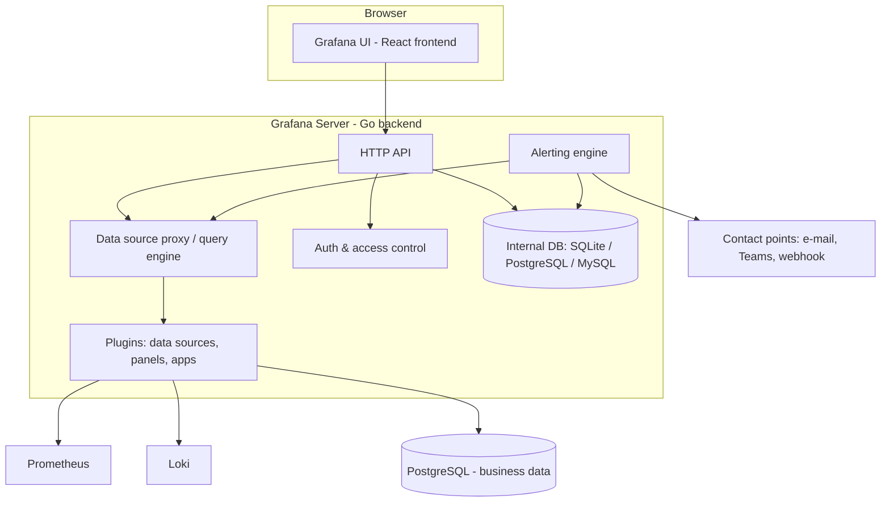

# Day 1 – Observability, Grafana Setup & Data Sources

**Previous:** [Day 0 – Course Introduction](day00-intro.md) | **Next:** [Day 2 – Dashboards & Querying](day02-dashboards-querying.md)

---

## Contents

1. [Learning Goals](#learning-goals)
2. [Concepts](#concepts)
   - 1.1 Monitoring vs Observability
   - 1.2 Metrics, Logs and Traces
   - 1.3 Golden Signals, RED and USE
   - 1.4 Grafana Architecture
   - 1.5 Grafana Editions: OSS, Enterprise, Cloud
   - 1.6 Deployment Options: Windows, Linux, Docker, Kubernetes
   - 1.7 Grafana Configuration and Server Log
   - 1.8 UI Tour
   - 1.9 Data Sources
3. [Labs](#labs)
   - Lab 1: Set up the Windows lab stack
   - Lab 2: Grafana configuration, server log and UI tour
   - Lab 3: Connect data sources
   - Lab 4: Import and study a community dashboard
4. [Exercises](#exercises)
5. [Troubleshooting](#troubleshooting)
6. [Quiz](#quiz)
7. [Summary & Cheat Sheet](#summary--cheat-sheet)
8. [Answers](#answers)
9. [Appendix A – Sample Application Files](#appendix-a--sample-application-files)

---

## Learning Goals

By the end of Day 1, you will be able to:

- Explain the difference between monitoring and observability
- Describe metrics, logs and traces, and when to use each
- Apply the Golden Signals, RED and USE methods to decide what to monitor
- Describe Grafana's architecture and compare its editions
- Install and run the full lab stack natively on Windows 11
- Read and change Grafana configuration using `custom.ini`, and use the server log
- Connect Prometheus, Loki and PostgreSQL as data sources and test them in Explore
- Import a community dashboard and understand how it is built

---

## Concepts

### 1.1 Monitoring vs Observability

**Monitoring** answers questions you already know to ask:

- Is the CPU above 90%?
- Is the website up?
- Is the error rate above 5%?

You decide in advance what to measure, set thresholds and alert on them.

**Observability** is the ability to answer questions you did *not* plan for, by exploring the data a system emits. For example:

- *Why* are checkout requests from the south region slow since 11:00?
- *Which* database query inside those requests is taking the time?

| | Monitoring | Observability |
|---|---|---|
| Question type | Known questions ("known unknowns") | New questions ("unknown unknowns") |
| Typical output | Dashboards, threshold alerts | Ad-hoc exploration, correlation, drill-down |
| Data | Mostly metrics | Metrics + logs + traces, linked together |
| Answers | *Something* is wrong | *What* is wrong, *where* and *why* |

Observability does not replace monitoring; it builds on it. In practice:

1. Monitoring (dashboards and alerts) tells you **that** something is wrong.
2. Observability (Explore, logs, traces) helps you find **why**.

> **Where Grafana fits:** Grafana does not collect or store your monitoring data. It is the **single pane of glass** that:
> - queries many data sources,
> - visualises the results,
> - alerts on them, and
> - lets you jump between metrics, logs and traces.

### 1.2 Metrics, Logs and Traces

These are often called the **three pillars of observability**.

| Signal | What it is | Example from our lab | Strength | Limitation |
|---|---|---|---|---|
| **Metrics** | Numbers measured over time, identified by a name and labels | `http_requests_total{route="/api/orders", status="500"}` | Cheap to store, fast to query, ideal for dashboards and alerts | Little detail: tells you *how many*, not *which one* |
| **Logs** | Timestamped records of individual events | `{"level":"error","route":"/api/orders","msg":"request failed"}` | Full detail of each event | Expensive at high volume; harder to aggregate |
| **Traces** | The journey of one request through services, made of *spans* | `POST /api/orders` → `INSERT INTO orders` → response (Day 4) | Shows *where* time is spent across components | Usually sampled; needs instrumentation |

**How they work together, a typical investigation:**

```
Alert fires (metric) ──► Dashboard shows error spike at 11:02 (metric)
       ──► Explore logs for 11:00–11:05, filter level=error (logs)
       ──► Open the trace ID from a log line (trace)
       ──► See the DB INSERT span taking 2.4 s ──► Root cause found
```

**Metric types you will meet (Prometheus):**

| Type | Behaviour | Example | Typical query |
|---|---|---|---|
| Counter | Only goes up (resets on restart) | `http_requests_total` | `rate(http_requests_total[5m])` |
| Gauge | Goes up and down | `http_requests_in_flight`, free memory | Use directly, or `avg_over_time()` |
| Histogram | Counts observations in buckets | `http_request_duration_seconds` | `histogram_quantile(0.95, ...)` |
| Summary | Pre-calculated quantiles on the client | Some libraries' latency metrics | Use as-is (cannot aggregate across instances) |

### 1.3 Golden Signals, RED and USE

With hundreds of metrics available, these three methods help you decide **what matters**.

**Four Golden Signals** (from the Google SRE book): for any user-facing system.

| Signal | Question | Example metric in our lab |
|---|---|---|
| **Latency** | How long do requests take? | `http_request_duration_seconds` (p95) |
| **Traffic** | How much demand is there? | `rate(http_requests_total[5m])` |
| **Errors** | How many requests fail? | Rate of requests with `status=~"5.."` |
| **Saturation** | How "full" is the system? | CPU %, memory %, requests in flight |

**RED method:** for **request-driven services** (APIs, web apps, microservices).

- **R**ate: requests per second
- **E**rrors: failed requests per second (or error %)
- **D**uration: latency distribution (p50, p95, p99)

**USE method:** for **resources** (CPU, memory, disk, network, connection pools).

- **U**tilisation: % of time the resource is busy (e.g. CPU 75%)
- **S**aturation: extra work queued (e.g. processor queue length, disk queue)
- **E**rrors: error events (e.g. disk errors, dropped network packets)

**Which method applies where in our lab:**

| Component | Method | Dashboard we build |
|---|---|---|
| `orders-api` (Node.js service) | RED | Application dashboard (Day 2) |
| Windows host (CPU, memory, disk, network) | USE | Host dashboard (Day 2) |
| The whole system, as users see it | Golden Signals | Overview dashboard (Day 5 capstone) |

> **Tip:** A good service dashboard starts with RED at the top. Supporting USE panels for the underlying host go below. Put the most important signal in the top-left: people read dashboards like a page.

### 1.4 Grafana Architecture



**Key components:**

| Component | Role |
|---|---|
| **Frontend (UI)** | Runs in your browser. Renders dashboards, the panel editor and Explore. |
| **Backend server** | A single Go binary (`grafana.exe server`). Serves the UI and the HTTP API. |
| **Query engine / data source proxy** | Sends queries to data sources and returns results. Credentials stay on the server, not in the browser. |
| **Plugins** | Data source plugins (Prometheus, Loki, PostgreSQL, …), panel plugins (visualisations) and app plugins (e.g. the Drilldown apps). |
| **Alerting engine** | Evaluates alert rules on a schedule, on the server. It does not need a browser open. |
| **Internal database** | Stores Grafana's *own* data: users, dashboards, data source settings, alert rules. Default is SQLite (`data\grafana.db`); production often uses PostgreSQL or MySQL. |
| **Auth & access control** | Users, teams, roles, and login via LDAP, OAuth or SAML (Day 5). |

> **Important:** Grafana does **not** store your metrics or logs. If Prometheus is down, the Prometheus panels show errors, but Grafana itself keeps working. The only data Grafana owns is in its internal database.

### 1.5 Grafana Editions: OSS, Enterprise, Cloud

| | **Grafana OSS** | **Grafana Enterprise** | **Grafana Cloud** |
|---|---|---|---|
| Licence | Open source (AGPLv3), free | Commercial licence | SaaS subscription (free tier available) |
| Hosting | You run it | You run it | Hosted by Grafana Labs |
| Core dashboards, alerting, Explore | ✅ | ✅ | ✅ |
| Enterprise data sources (Splunk, ServiceNow, Oracle, Snowflake, …) | ❌ | ✅ | ✅ |
| Fine-grained RBAC, team sync | Basic roles only | ✅ | ✅ |
| Reporting (scheduled PDF reports) | ❌ | ✅ | ✅ |
| Data source permissions, auditing | ❌ | ✅ | ✅ |
| Hosted Prometheus / Loki / Tempo | ❌ | ❌ | ✅ (Mimir, Loki, Tempo backends) |
| Support | Community | Grafana Labs | Grafana Labs (paid tiers) |

In this course we use **Grafana OSS**. Enterprise features are covered on Day 5 (and on Day 4 if that track is chosen).

> **Tip:** The Enterprise *binary* can run without a licence and then behaves exactly like OSS. Many organisations install it so they can switch on licensed features later without reinstalling.

### 1.6 Deployment Options: Windows, Linux, Docker, Kubernetes

In class we install Grafana on **Windows**. In real projects, Grafana usually runs on Linux, in Docker or on Kubernetes. The concepts are the same everywhere.

**Windows** (our lab):

- **MSI installer:** installs Grafana as a Windows service under `C:\Program Files\GrafanaLabs\grafana`.
- **Standalone ZIP:** extract and run. No admin rights needed. **We use this**, so everything stays under `C:\grafana-lab`.

**Linux (Debian/Ubuntu):**

```bash
sudo apt-get install -y apt-transport-https software-properties-common wget
sudo mkdir -p /etc/apt/keyrings/
wget -q -O - https://apt.grafana.com/gpg.key | gpg --dearmor | sudo tee /etc/apt/keyrings/grafana.gpg > /dev/null
echo "deb [signed-by=/etc/apt/keyrings/grafana.gpg] https://apt.grafana.com stable main" | sudo tee /etc/apt/sources.list.d/grafana.list
sudo apt-get update && sudo apt-get install -y grafana
sudo systemctl enable --now grafana-server
```

On Linux:

- Config file: `/etc/grafana/grafana.ini`
- Log file: `/var/log/grafana/grafana.log`
- Data: `/var/lib/grafana`

**Docker:**

```bash
docker run -d --name grafana -p 3000:3000 \
  -v grafana-storage:/var/lib/grafana \
  -e GF_SECURITY_ADMIN_PASSWORD=ChangeMe123 \
  grafana/grafana:latest
```

- Always mount a volume for `/var/lib/grafana`, or you lose dashboards when the container is recreated.
- Configure Grafana with `GF_<SECTION>_<KEY>` environment variables (see 1.7).

**Kubernetes (Helm):**

```bash
helm repo add grafana https://grafana.github.io/helm-charts
helm install grafana grafana/grafana --namespace monitoring --create-namespace \
  --set persistence.enabled=true --set adminPassword='ChangeMe123'
```

In Kubernetes, data sources and dashboards are usually **provisioned** from ConfigMaps (Day 5). This avoids clicking through the UI.

| Option | Typical use | Config location |
|---|---|---|
| Windows ZIP / MSI | Labs, Windows-only shops | `conf\custom.ini` |
| Linux package | VMs, traditional servers | `/etc/grafana/grafana.ini` |
| Docker | Dev, small setups, CI | Environment variables, mounted `.ini` |
| Kubernetes (Helm) | Production, scalable | Helm `values.yaml`, ConfigMaps |

### 1.7 Grafana Configuration and Server Log

**Configuration files (Windows ZIP install):**

| File | Purpose | Edit it? |
|---|---|---|
| `conf\defaults.ini` | Every setting with its default value | ❌ **Never.** It is overwritten on upgrade. |
| `conf\sample.ini` | Commented example of all settings | Reference only |
| `conf\custom.ini` | **Your** overrides | ✅ Yes. Put only the settings you change. |

**Order of precedence (highest wins):**

```
Environment variables (GF_...)  >  custom.ini  >  defaults.ini
```

**Settings you will use most often:**

| Section | Key | Example | Meaning |
|---|---|---|---|
| `[server]` | `http_port` | `3000` | Port Grafana listens on |
| `[server]` | `root_url` | `http://localhost:3000/` | Public URL (used in alert links, OAuth) |
| `[database]` | `type` | `sqlite3` | Internal DB: `sqlite3`, `postgres`, `mysql` |
| `[security]` | `admin_user` | `admin` | Initial admin user name |
| `[security]` | `allow_embedding` | `false` | Allow Grafana inside iframes |
| `[users]` | `allow_sign_up` | `false` | Let people self-register |
| `[auth.anonymous]` | `enabled` | `false` | View dashboards without login |
| `[log]` | `mode` | `console file` | Where logs go |
| `[log]` | `level` | `info` | `debug`, `info`, `warn`, `error` |
| `[smtp]` | `enabled`, `host` | `smtp.office365.com:587` | E-mail for alerts (Day 3) |

**Environment variable form:** `GF_<SECTION>_<KEY>`, in upper case, with dots and dashes replaced by `_`.

- `[server] http_port` → `GF_SERVER_HTTP_PORT`
- `[auth.anonymous] enabled` → `GF_AUTH_ANONYMOUS_ENABLED`

> **Remember:** Grafana reads configuration **only at startup**. After editing `custom.ini`, restart Grafana.

**Server log:** your first stop when something is wrong.

- Location (our lab): `C:\grafana-lab\grafana\data\log\grafana.log`
- Format: `logfmt` (`key=value` pairs). A typical line:

```
logger=http.server t=2026-10-05T10:15:02.114+05:30 level=info msg="HTTP Server Listen" address=[::]:3000 protocol=http
```

- Useful filters: `level=error`, `logger=datasources`, `logger=ngalert` (alerting), `logger=context` (HTTP requests: failed ones by default, every request when `[server] router_logging = true`).

### 1.8 UI Tour

| Area | Where | What you do there |
|---|---|---|
| **Home** | Grafana logo / Home | Starred and recent dashboards |
| **Search** | Top bar (or `Ctrl+K`) | Find dashboards, folders, settings |
| **Dashboards** | Menu → Dashboards | Browse folders, create, import, organise |
| **Explore** | Menu → Explore | Ad-hoc queries on any data source, with no dashboard needed |
| **Drilldown** | Menu → Drilldown | Query-less exploration apps for metrics, logs and traces (Day 2) |
| **Alerting** | Menu → Alerting | Alert rules, contact points, notification policies (Day 3) |
| **Connections** | Menu → Connections | Add and manage data sources and plugins |
| **Administration** | Menu → Administration | Users, teams, orgs, service accounts, settings (Day 5) |
| **Profile** | Avatar (top right) | Change password, theme, timezone, home dashboard |

**Useful keyboard shortcuts** (press `?` in Grafana to see all):

| Shortcut | Action |
|---|---|
| `Ctrl+K` | Search / command palette |
| `d` then `r` | Refresh dashboard |
| `t` then `z` | Zoom out time range |
| `t` then `←` / `→` | Move time range back / forward |
| `Ctrl+S` | Save dashboard |
| `e` | Open panel editor (while hovering a panel) |
| `v` | View panel in full screen (while hovering) |
| `Esc` | Exit panel edit / full screen |

### 1.9 Data Sources

A **data source** is a configured connection from Grafana to a backend. Each data source type is a plugin with its own query editor and query language.

**Data sources used in this course:**

| Data source | Stores | Query language | Access in our lab |
|---|---|---|---|
| **Prometheus** | Metrics (time series) | PromQL | `http://localhost:9090` |
| **Loki** | Logs | LogQL | `http://localhost:3100` |
| **PostgreSQL** | Relational / business data | SQL | `localhost:5432`, database `ordersdb` |
| **MySQL** | Relational data | SQL | Same approach as PostgreSQL (overview only) |

**How Prometheus collects data: the pull model.**

```
Prometheus ──(every 15 s: HTTP GET /metrics)──► orders-api :8080
           ──(every 15 s: HTTP GET /metrics)──► windows_exporter :9182
```

Every target Prometheus scrapes gets an automatic metric `up` (1 = scrape succeeded, 0 = failed). It also gets labels `job` and `instance`.

**How Loki collects data: the push model.**

```
orders-api writes C:\grafana-lab\sample-app\logs\app.log
   ──► Alloy tails the file ──(HTTP POST /loki/api/v1/push)──► Loki :3100
```

Loki indexes only **labels** (e.g. `job`, `service_name`), not the full log text. This keeps it cheap. You filter the text at query time.

**Other important data sources (overview):**

| Data source | When you would use it | Notes |
|---|---|---|
| **Azure Monitor** | Azure VMs, App Service, AKS, Log Analytics (KQL), Application Insights | Built-in. Authenticate with an app registration or managed identity. |
| **Amazon CloudWatch** | AWS metrics and CloudWatch Logs | Built-in. Authenticate with an IAM role or access keys. |
| **Elasticsearch / OpenSearch** | Existing ELK log platforms | Lucene or PPL queries; good for log search |
| **InfluxDB** | IoT and time-series workloads | InfluxQL, Flux or SQL (v3) |
| **REST / JSON / CSV** | Any HTTP API, CSV files, Excel exports | Via the **Infinity** plugin (`yesoreyeram-infinity-datasource`) |
| **TestData** | Built-in fake data for learning and testing panels | No setup needed |

> **Best practice:** Create a **read-only** database user for Grafana (we create `grafana_reader` in the lab). A dashboard's SQL panel can run any SQL the database user is allowed to run. Never connect Grafana to a production database as an owner or admin.

---

## Labs

> **Before you start:**
> - Keep a PowerShell window open. Open it **as Administrator** only when a step says so.
> - Every lab uses the folder layout from Day 0, section 9.
> - Version numbers in the expected outputs may differ slightly from yours. That's fine.

### Lab 1: Set up the Windows lab stack

**Goal:** Install and run every lab component, and confirm they talk to each other.

**Time:** about 90 minutes (less if IT has pre-installed the software)

> **Note:** This lab is also the **pre-training setup guide**.
> - If you completed it before Day 1, use this session to follow the trainer's walkthrough of each component and re-check Step 1.11.
> - If not, complete it now with the trainer's help.

**What you'll build:**

| Order | Component | Why this order |
|---|---|---|
| 1 | Folders, Node.js | Base tools |
| 2 | PostgreSQL + database | The sample app needs it to start |
| 3 | windows_exporter | Host metrics |
| 4 | orders-api sample app | Produces metrics, logs and orders |
| 5 | Prometheus | Scrapes the app and windows_exporter |
| 6 | Loki + Alloy | Collect and store the app's logs |
| 7 | Grafana | Visualises everything |
| 8 | Start/stop scripts + load generator | Easy daily start-up and steady traffic |

#### Step 1.1: Downloads

Download the following into your `Downloads` folder, unless IT has already provided them.

| Component | Where | File to pick |
|---|---|---|
| Git for Windows | `https://git-scm.com/download/win` | 64-bit installer (skip if Git is already installed) |
| Node.js LTS (24.x) | `https://nodejs.org/en/download` | Windows Installer (`.msi`), or Standalone Binary (`.zip`) if you lack admin rights |
| PostgreSQL | `https://www.postgresql.org/download/windows/` | EDB installer for Windows x86-64 |
| windows_exporter | `https://github.com/prometheus-community/windows_exporter/releases` | `windows_exporter-<version>-amd64.msi` |
| Prometheus | `https://github.com/prometheus/prometheus/releases` | `prometheus-<version>.windows-amd64.zip` |
| Loki | `https://github.com/grafana/loki/releases` | `loki-windows-amd64.exe.zip` |
| Grafana Alloy | `https://github.com/grafana/alloy/releases` | `alloy-windows-amd64.exe.zip` |
| Grafana OSS | `https://grafana.com/grafana/download?platform=windows` | Standalone Windows Binaries (`.zip`) |

#### Step 1.2: Create the lab folders

```powershell
$lab = 'C:\grafana-lab'
'grafana','prometheus','windows_exporter','loki','alloy','sample-app\sql',
'provisioning','dashboards','terraform','tmp' | ForEach-Object {
    New-Item -ItemType Directory -Path "$lab\$_" -Force | Out-Null
}
Get-ChildItem $lab
```

✅ **Expected:** folders listed under `C:\grafana-lab`.

> **Tip:** Every new PowerShell window forgets variables. When a later step uses `$lab`, first run `$lab = 'C:\grafana-lab'` again.

#### Step 1.3: Install Node.js

1. Run the Node.js `.msi` and accept the defaults.
   - **If you have no admin rights:** extract the `.zip` to `C:\grafana-lab\node` instead, then run `$env:Path += ';C:\grafana-lab\node'` in each new PowerShell window.
2. Open a **new** PowerShell window and verify:

```powershell
node -v
npm -v
```

✅ **Expected:** `v24.x.x` and an npm version number.

> ⚠️ **Watch out:** On a corporate network, `npm install` may need a proxy:
> ```powershell
> npm config set proxy http://<proxy-host>:<port>
> npm config set https-proxy http://<proxy-host>:<port>
> ```

#### Step 1.4: Install PostgreSQL and create the database

1. Run the EDB PostgreSQL installer and choose these options:
   - Components: **PostgreSQL Server** and **Command Line Tools**. pgAdmin is optional; skip Stack Builder.
   - Password for the `postgres` superuser: choose one and **note it down**.
   - Port: **5432**
   - Locale: default
2. Get the sample application from the lab repository. It includes the SQL scripts used below.

```powershell
git clone <lab-repo-url> C:\grafana-lab\repo
Copy-Item C:\grafana-lab\repo\sample-app\* C:\grafana-lab\sample-app\ -Recurse -Force
Get-ChildItem C:\grafana-lab\sample-app -Recurse -Name
```

✅ **Expected:** `.gitignore`, `app.js`, `load.js`, `package.json`, `README.md`, `sql\setup-db.sql`, `sql\schema.sql`

   Replace `<lab-repo-url>` with the link shared by the trainer. If Git is blocked, download the repository as a ZIP from GitHub (**Code → Download ZIP**) and copy its `sample-app` folder instead.

3. Run the scripts. Replace `17` with your PostgreSQL major version if it differs.

```powershell
$lab = 'C:\grafana-lab'
$env:Path += ';C:\Program Files\PostgreSQL\17\bin'

# 1. Create users and database (as the postgres superuser)
$env:PGPASSWORD = '<your-postgres-password>'
psql -U postgres -h localhost -f "$lab\sample-app\sql\setup-db.sql"

# 2. Create the orders table, grants and 30 days of seed data (as the app owner)
$env:PGPASSWORD = 'orders_app_pw'
psql -U orders_app -h localhost -d ordersdb -f "$lab\sample-app\sql\schema.sql"

# 3. Verify with the read-only user Grafana will use
$env:PGPASSWORD = 'grafana_reader_pw'
psql -U grafana_reader -h localhost -d ordersdb -c "SELECT status, count(*) FROM orders GROUP BY status;"
```

✅ **Expected:** two rows, `PAID` (about 4,500) and `PAYMENT_FAILED` (about 500).

**The database objects you just created:**

| Object | Purpose |
|---|---|
| Database `ordersdb` | Business data for SQL dashboards |
| User `orders_app` | Owner; used by the sample app to insert orders |
| User `grafana_reader` | **Read-only**; used by Grafana |
| Table `orders` | One row per order: time, customer, product, region, quantity, amount, status |

> **Note:** These lab passwords are deliberately simple. In real projects, use strong passwords and keep them in a secret store.

#### Step 1.5: Install windows_exporter

1. Open PowerShell **as Administrator** and run:

```powershell
cd $HOME\Downloads
msiexec /i windows_exporter-<version>-amd64.msi
```

   The MSI installs a Windows service called `windows_exporter`, listening on port **9182**.

2. Verify:

```powershell
Get-Service windows_exporter
(Invoke-WebRequest http://localhost:9182/metrics -UseBasicParsing).Content -split "`n" |
    Select-String '^windows_cpu_time_total' | Select-Object -First 3
```

✅ **Expected:** service status `Running`, and a few `windows_cpu_time_total{core="0,0",mode="idle"} ...` lines.

> **Tip:** You can also open `http://localhost:9182/metrics` in the browser. This is the **Prometheus exposition format**, plain text in the form `metric_name{labels} value`. Every exporter and instrumented app exposes this format.

#### Step 1.6: Set up the sample application (orders-api)

1. The app's files are already in `C:\grafana-lab\sample-app`, copied from the lab repository in Step 1.4. See [Appendix A](#appendix-a--sample-application-files) for what each file does.
2. Install the dependencies:

```powershell
cd C:\grafana-lab\sample-app
npm install
```

3. Start the app:

```powershell
node app.js
```

✅ **Expected:** `orders-api listening on http://localhost:8080`

4. Open a **second** PowerShell window and test the app:

```powershell
# Health
Invoke-RestMethod http://localhost:8080/health

# Products
Invoke-RestMethod http://localhost:8080/api/products

# Create an order
Invoke-RestMethod -Method Post http://localhost:8080/api/orders -ContentType 'application/json' `
  -Body '{"customer":"acme","product":"laptop","region":"south","quantity":1}'

# Metrics endpoint
(Invoke-WebRequest http://localhost:8080/metrics -UseBasicParsing).Content -split "`n" |
    Select-String '^http_requests_total'

# Log file
Get-Content C:\grafana-lab\sample-app\logs\app.log -Tail 3
```

✅ **Expected:**
- `{"status":"UP"}`
- A list of 5 products
- A new order `id`
- `http_requests_total{...}` lines
- JSON log lines such as `{"level":"info","time":"...","service":"orders-api","method":"POST","route":"/api/orders","status":201,...,"msg":"request completed"}`

5. Stop the app with `Ctrl+C` in the first window. From Step 1.10 onwards, the start script runs it for you.

**What orders-api provides:**

| Endpoint | Purpose |
|---|---|
| `GET /health` | Health check |
| `GET /api/products` | List products |
| `POST /api/orders` | Create an order (inserts into PostgreSQL; ~10% get status `PAYMENT_FAILED`) |
| `GET /api/orders` | Latest 20 orders |
| `GET /api/orders/:id` | One order (`404` if not found) |
| `GET /api/slow` | Deliberately slow endpoint (0.5–2.5 s) |
| `GET /metrics` | Prometheus metrics |
| `GET` / `POST /admin/chaos` | View or set fault injection: `errorRate` (0–1) and `latencyMs` |

| Metric | Type | Labels |
|---|---|---|
| `http_requests_total` | Counter | `method`, `route`, `status` |
| `http_request_duration_seconds` | Histogram | `method`, `route`, `status` |
| `http_requests_in_flight` | Gauge | none |
| `orders_created_total` | Counter | `product`, `region` |
| `app_chaos_error_rate`, `app_chaos_latency_ms` | Gauge | none (current fault settings) |
| `process_*`, `nodejs_*` | Various | Default Node.js runtime metrics |

#### Step 1.7: Install and configure Prometheus

1. Extract Prometheus:

```powershell
$lab = 'C:\grafana-lab'
$zip = Get-ChildItem "$HOME\Downloads\prometheus-*.windows-amd64.zip" | Sort-Object Name -Descending | Select-Object -First 1
Expand-Archive $zip.FullName -DestinationPath "$lab\tmp" -Force
Copy-Item "$lab\tmp\prometheus-*\*" "$lab\prometheus\" -Recurse -Force
Get-ChildItem "$lab\prometheus"
```

2. Replace `C:\grafana-lab\prometheus\prometheus.yml` with:

```yaml
# C:\grafana-lab\prometheus\prometheus.yml
global:
  scrape_interval: 15s       # how often to scrape targets
  evaluation_interval: 15s   # how often to evaluate recording/alert rules

scrape_configs:
  - job_name: prometheus     # Prometheus monitors itself
    static_configs:
      - targets: ["localhost:9090"]

  - job_name: windows        # Windows host metrics
    static_configs:
      - targets: ["localhost:9182"]

  - job_name: orders-api     # our Node.js sample app
    static_configs:
      - targets: ["localhost:8080"]
```

3. Validate the file and run Prometheus:

```powershell
cd "$lab\prometheus"
.\promtool.exe check config prometheus.yml
.\prometheus.exe --config.file=prometheus.yml --storage.tsdb.path=data --web.enable-lifecycle
```

✅ **Expected:** `SUCCESS: prometheus.yml is valid prometheus config file syntax`. Prometheus then logs `Server is ready to receive web requests.`

4. Open `http://localhost:9090` → **Status → Target health**.

✅ **Expected:** `prometheus` and `windows` are **UP**. `orders-api` is **DOWN**, because the app is stopped right now. That's fine.

5. Stop Prometheus with `Ctrl+C`.

> **Tip:** `--web.enable-lifecycle` lets you reload the config without a restart:
> ```powershell
> Invoke-RestMethod -Method Post http://localhost:9090/-/reload
> ```

#### Step 1.8: Install and configure Loki

1. Extract Loki:

```powershell
$lab = 'C:\grafana-lab'
Expand-Archive "$HOME\Downloads\loki-windows-amd64.exe.zip" -DestinationPath "$lab\loki" -Force
```

2. Create `C:\grafana-lab\loki\loki-config.yaml`:

```yaml
# C:\grafana-lab\loki\loki-config.yaml  (single-node lab configuration)
auth_enabled: false            # no multi-tenancy in the lab

server:
  http_listen_port: 3100
  grpc_listen_port: 9096

common:
  instance_addr: 127.0.0.1
  path_prefix: C:/grafana-lab/loki/data
  storage:
    filesystem:
      chunks_directory: C:/grafana-lab/loki/data/chunks
      rules_directory: C:/grafana-lab/loki/data/rules
  replication_factor: 1
  ring:
    kvstore:
      store: inmemory

schema_config:
  configs:
    - from: 2024-01-01
      store: tsdb
      object_store: filesystem
      schema: v13
      index:
        prefix: index_
        period: 24h

limits_config:
  allow_structured_metadata: true
  volume_enabled: true         # needed by Logs Drilldown (Day 2)

pattern_ingester:
  enabled: true                # log pattern detection for Logs Drilldown
```

> ⚠️ **Watch out:** Use **forward slashes** (`C:/grafana-lab/...`) in YAML paths. Backslashes can be read as escape characters.

3. Test it:

```powershell
cd "$lab\loki"
.\loki-windows-amd64.exe -config.file=loki-config.yaml
```

   In another window, wait about 30 seconds, then run:

```powershell
Invoke-RestMethod http://localhost:3100/ready
```

✅ **Expected:** `ready`. Keep Loki running for the next step.

#### Step 1.9: Install and configure Grafana Alloy

1. Extract Alloy:

   Use the second PowerShell window; Loki keeps running in the first.

```powershell
$lab = 'C:\grafana-lab'
Expand-Archive "$HOME\Downloads\alloy-windows-amd64.exe.zip" -DestinationPath "$lab\alloy" -Force
```

2. Create `C:\grafana-lab\alloy\config.alloy`:

```alloy
// C:\grafana-lab\alloy\config.alloy
// Tail the orders-api log files and push them to Loki.

local.file_match "orders_api_logs" {
  path_targets = [{
    "__path__"     = "C:/grafana-lab/sample-app/logs/*.log",
    "job"          = "orders-api",
    "service_name" = "orders-api",
  }]
}

loki.source.file "orders_api_logs" {
  targets    = local.file_match.orders_api_logs.targets
  forward_to = [loki.write.local.receiver]
}

loki.write "local" {
  endpoint {
    url = "http://localhost:3100/loki/api/v1/push"
  }
}
```

**How to read this config:** Alloy configs are *pipelines* of named components.

```
local.file_match  ──targets──►  loki.source.file  ──log lines──►  loki.write  ──HTTP──►  Loki
(find the files,                (tail the files)                  (send to Loki)
 attach labels)
```

   - Each block is `component.type "label" { ... }`.
   - Components are wired together by referencing each other's exports, e.g. `loki.write.local.receiver`.

3. Run Alloy:

```powershell
cd "$lab\alloy"
.\alloy-windows-amd64.exe run config.alloy --storage.path=data
```

4. Open the Alloy UI at `http://localhost:12345`.

✅ **Expected:** all three components are shown as **healthy**. Click **Graph** to see the pipeline.

5. Stop Alloy and Loki with `Ctrl+C` in their windows.

#### Step 1.10: Install and configure Grafana

1. Extract Grafana:

```powershell
$lab = 'C:\grafana-lab'
$zip = Get-ChildItem "$HOME\Downloads\grafana-*.windows-amd64.zip" | Sort-Object Name -Descending | Select-Object -First 1
Expand-Archive $zip.FullName -DestinationPath "$lab\tmp" -Force
Copy-Item "$lab\tmp\grafana-*\*" "$lab\grafana\" -Recurse -Force
Get-ChildItem "$lab\grafana"     # expect: bin, conf, public, ...
```

2. Create `C:\grafana-lab\grafana\conf\custom.ini`:

```ini
; C:\grafana-lab\grafana\conf\custom.ini  - only the settings we override
[server]
http_port = 3000
root_url = http://localhost:3000/

[security]
admin_user = admin

[users]
allow_sign_up = false

[log]
mode = console file
level = info
```

3. Unblock the downloaded executables. This prevents Windows SmartScreen prompts.

```powershell
Get-ChildItem $lab -Recurse -Include *.exe | Unblock-File
```

4. Create the start and stop scripts.

`C:\grafana-lab\start-lab.ps1`:

```powershell
# start-lab.ps1 - starts the Grafana lab stack
# Usage:  .\start-lab.ps1            (stack only)
#         .\start-lab.ps1 -WithLoad  (stack + load generator)
param([switch]$WithLoad)
$lab = 'C:\grafana-lab'

function Start-LabProcess {
    param([string]$Name, [string]$File, [string[]]$ArgList, [string]$Dir)
    Write-Host "Starting $Name ..."
    Start-Process -FilePath $File -ArgumentList $ArgList -WorkingDirectory $Dir -WindowStyle Minimized
}

Start-LabProcess 'Prometheus' "$lab\prometheus\prometheus.exe" `
    @("--config.file=$lab\prometheus\prometheus.yml", "--storage.tsdb.path=$lab\prometheus\data", "--web.enable-lifecycle") "$lab\prometheus"
Start-LabProcess 'Loki' "$lab\loki\loki-windows-amd64.exe" @("-config.file=$lab\loki\loki-config.yaml") "$lab\loki"
Start-LabProcess 'Alloy' "$lab\alloy\alloy-windows-amd64.exe" @("run", "$lab\alloy\config.alloy", "--storage.path=$lab\alloy\data") "$lab\alloy"
Start-LabProcess 'Grafana' "$lab\grafana\bin\grafana.exe" @("server", "--homepath", "$lab\grafana") "$lab\grafana"
Start-LabProcess 'orders-api' 'node' @('app.js') "$lab\sample-app"

if ($WithLoad) {
    Start-Sleep -Seconds 5
    Start-LabProcess 'Load generator' 'node' @('load.js', '5') "$lab\sample-app"
}

Write-Host "`nWaiting 20 seconds for components to start ..."
Start-Sleep -Seconds 20
3000, 9090, 9182, 3100, 5432, 8080, 12345 | ForEach-Object {
    $ok = (Test-NetConnection localhost -Port $_ -WarningAction SilentlyContinue).TcpTestSucceeded
    "{0,-6} {1}" -f $_, $(if ($ok) { 'OK' } else { 'NOT LISTENING' })
}
```

`C:\grafana-lab\stop-lab.ps1`:

```powershell
# stop-lab.ps1 - stops the lab stack (windows_exporter and PostgreSQL services keep running)
Get-Process prometheus, loki-windows-amd64, alloy-windows-amd64, grafana, grafana-server `
    -ErrorAction SilentlyContinue | Stop-Process -Force
Get-CimInstance Win32_Process -Filter "Name='node.exe'" |
    Where-Object { $_.CommandLine -match 'app\.js|load\.js' } |
    ForEach-Object { Stop-Process -Id $_.ProcessId -Force }
Write-Host 'Lab stack stopped.'
```

5. Allow local scripts to run. This is needed once per user.

```powershell
Set-ExecutionPolicy -Scope CurrentUser -ExecutionPolicy RemoteSigned
```

   If policy changes are blocked, run the scripts with `powershell -ExecutionPolicy Bypass -File C:\grafana-lab\start-lab.ps1`.

6. Start everything, with load:

```powershell
C:\grafana-lab\start-lab.ps1 -WithLoad
```

✅ **Expected:** all seven ports report `OK`. Minimised windows appear on the taskbar, one per component. **Do not close them.**

7. Open `http://localhost:3000` and log in with `admin` / `admin`. When prompted, set a new password and **note it down**.

✅ **Expected:** the Grafana home page with "Welcome to Grafana".

#### Step 1.11: Final checks

1. Prometheus → **Status → Target health**: all three jobs (`prometheus`, `windows`, `orders-api`) are **UP**.
2. Loki has received logs. This command lists label values for `job`:

```powershell
Invoke-RestMethod "http://localhost:3100/loki/api/v1/label/job/values"
```

✅ **Expected:** `data` contains `orders-api`.

3. New orders are arriving in PostgreSQL. Run this twice, a minute apart; the count should grow:

```powershell
$env:PGPASSWORD = 'grafana_reader_pw'
psql -U grafana_reader -h localhost -d ordersdb -c "SELECT count(*) FROM orders WHERE created_at > now() - interval '5 minutes';"
```

4. Run the **Pre-Training Validation Checklist** from Day 0, section 10. Every item should pass.

🎉 **Your lab stack is complete.** From now on, start each training day with `C:\grafana-lab\start-lab.ps1 -WithLoad`.

---

### Lab 2: Grafana configuration, server log and UI tour

**Goal:** Change Grafana settings safely, confirm the order of precedence, and find your way around the UI.

**Time:** about 30 minutes

#### Step 2.1: View the effective configuration

1. In Grafana, go to **Administration → General → Settings**.
2. Find the `server` section and confirm `http_port = 3000`.
3. Find the `database` section and note the `type`.

✅ **Expected:** `sqlite3`. The Grafana internal DB file is `C:\grafana-lab\grafana\data\grafana.db`.

#### Step 2.2: Change settings in custom.ini

1. Open `C:\grafana-lab\grafana\conf\custom.ini` in VS Code and make two changes:
   - Add `default_theme = light` to the `[users]` section.
   - Add `router_logging = true` to the `[server]` section. This logs every HTTP request; we use it in Step 2.4.

   The two sections should now look like this:

```ini
[server]
http_port = 3000
root_url = http://localhost:3000/
router_logging = true

[users]
allow_sign_up = false
default_theme = light
```

   Merge the new keys into the existing sections; do not create a second `[server]` or `[users]` header.

2. Restart Grafana only:

```powershell
Get-Process grafana -ErrorAction SilentlyContinue | Stop-Process -Force
Start-Process 'C:\grafana-lab\grafana\bin\grafana.exe' -ArgumentList 'server','--homepath','C:\grafana-lab\grafana' `
    -WorkingDirectory 'C:\grafana-lab\grafana' -WindowStyle Minimized
```

3. Open Grafana in a **private/incognito** browser window and log in.

✅ **Expected:** the light theme. Your own profile may still show your personal theme choice, because user preferences override the server default.

4. Remove `default_theme = light` and restart Grafana again. Keep `router_logging = true` for now.

#### Step 2.3: Prove the precedence rule (environment variable > custom.ini)

1. Stop Grafana.
2. Start it **in the foreground** with an environment variable:

```powershell
Get-Process grafana -ErrorAction SilentlyContinue | Stop-Process -Force
cd C:\grafana-lab\grafana
$env:GF_SERVER_HTTP_PORT = '3001'
.\bin\grafana.exe server --homepath C:\grafana-lab\grafana
```

3. Browse to `http://localhost:3001`.

✅ **Expected:** Grafana opens on **3001**, even though `custom.ini` says 3000. Port 3000 no longer responds.

4. Press `Ctrl+C`, then clear the variable and restart normally:

```powershell
Remove-Item Env:GF_SERVER_HTTP_PORT
Start-Process 'C:\grafana-lab\grafana\bin\grafana.exe' -ArgumentList 'server','--homepath','C:\grafana-lab\grafana' `
    -WorkingDirectory 'C:\grafana-lab\grafana' -WindowStyle Minimized
```

#### Step 2.4: Read the server log

```powershell
$log = 'C:\grafana-lab\grafana\data\log\grafana.log'

# Startup line with the Grafana version
Select-String -Path $log -Pattern 'Starting Grafana' | Select-Object -Last 1

# The HTTP server listen line (which port did it bind?)
Select-String -Path $log -Pattern 'HTTP Server Listen' | Select-Object -Last 3

# Any errors?
Select-String -Path $log -Pattern 'level=error' | Select-Object -Last 5

# Follow the log live (Ctrl+C to stop)
Get-Content $log -Tail 10 -Wait
```

While the live tail is running, click around in Grafana (open Dashboards, then Explore).

✅ **Expected:**
- the Grafana version;
- the 3001 and 3000 listen lines from Step 2.3;
- as you click, new lines like `logger=context ... msg="Request Completed" method=GET path=/api/... status=200`.

Finally, remove `router_logging = true` from `custom.ini` and restart Grafana. Logging every request is noisy, so it's normally used only while troubleshooting.

#### Step 2.5: UI tour tasks

Complete each task and tick it off:

- [ ] Open the command palette with `Ctrl+K` and search for "Explore"
- [ ] Open **Connections → Add new connection** and search for "PostgreSQL". Don't add it yet.
- [ ] Open **Alerting → Alert rules** (it's empty for now; Day 3)
- [ ] Open **Administration → Users and access → Users** and confirm `admin` is the only user
- [ ] Open your **Profile** and set **Timezone** to *Browser time* (or *Asia/Kolkata*)
- [ ] Open **Dashboards → New → New folder** and create a folder called `Lab Dashboards`
- [ ] Create another folder called `Community`
- [ ] Press `?` and look through the keyboard shortcuts

---

### Lab 3: Connect data sources

**Goal:** Connect Prometheus, Loki and PostgreSQL, and prove each one works with a query in Explore.

**Time:** about 40 minutes

#### Step 3.1: Add Prometheus

1. Go to **Connections → Data sources → Add data source → Prometheus**.
2. Fill in:

| Field | Value |
|---|---|
| Name | `Prometheus` |
| Default | **On** |
| Prometheus server URL | `http://localhost:9090` |
| Interval behaviour → Scrape interval | `15s` (must match `prometheus.yml`) |

3. Click **Save & test**.

✅ **Expected:** *Successfully queried the Prometheus API.*

> **Why set the scrape interval?** Grafana uses it to choose sensible `$__rate_interval` and step values. A mismatch causes gaps or jagged graphs (Day 2).

#### Step 3.2: Add Loki

1. **Add data source → Loki**.
2. Fill in:

| Field | Value |
|---|---|
| Name | `Loki` |
| URL | `http://localhost:3100` |

3. Click **Save & test**.

✅ **Expected:** *Data source successfully connected.*

#### Step 3.3: Add PostgreSQL

1. **Add data source → PostgreSQL**.
2. Fill in:

| Field | Value |
|---|---|
| Name | `PostgreSQL-Orders` |
| Host URL | `localhost:5432` |
| Database name | `ordersdb` |
| Username | `grafana_reader` |
| Password | `grafana_reader_pw` |
| TLS/SSL Mode | `disable` (lab only; use `require` or `verify-full` in production) |
| Version | Your PostgreSQL version, or leave the default |

3. Click **Save & test**.

✅ **Expected:** *Database Connection OK.*

#### Step 3.4: Test Prometheus in Explore

1. Go to **Explore** and select `Prometheus`.
2. Switch the query editor from **Builder** to **Code** (top right of the query row).
3. Run each query below, using a time range of **Last 15 minutes**.

| # | Query | What it shows |
|---|---|---|
| 1 | `up` | 1 per scrape target: all three should be 1 |
| 2 | `rate(http_requests_total[5m])` | Requests per second, per route and status |
| 3 | `sum by (route) (rate(http_requests_total[5m]))` | Requests per second, per route only |
| 4 | `100 - (avg(rate(windows_cpu_time_total{mode="idle"}[2m])) * 100)` | Host CPU usage % |
| 5 | `sum by (region) (increase(orders_created_total[15m]))` | Orders per region in the last 15 minutes |

✅ **Expected:** graphs for each query; `up` shows three series at 1.

> **Note:** Don't worry about PromQL syntax yet; it's covered in depth on Day 2. Today we only prove the connection works.

#### Step 3.5: Test Loki in Explore

1. In Explore, select `Loki` and switch to **Code**.
2. Run:

| # | Query | What it shows |
|---|---|---|
| 1 | `{job="orders-api"}` | All app log lines |
| 2 | `{job="orders-api"} \|= "order created"` | Lines containing the text "order created" |
| 3 | `{job="orders-api"} \| json \| status >= 400` | Parses JSON and keeps 4xx/5xx requests |
| 4 | `sum by (level) (count_over_time({job="orders-api"} \| json [1m]))` | Log volume per level, as a metric |

3. Click any log line to expand it. Note the parsed JSON fields: `level`, `route`, `status`, `duration_ms`, and so on.

✅ **Expected:** log lines for queries 1–3, and a graph for query 4.

#### Step 3.6: Test PostgreSQL in Explore

1. In Explore, select `PostgreSQL-Orders` and switch to **Code**.
2. Set the **Format** to **Table**.
3. Run:

```sql
SELECT region, count(*) AS orders, round(sum(amount), 2) AS revenue
FROM orders
WHERE created_at > now() - interval '7 days'
GROUP BY region
ORDER BY revenue DESC;
```

✅ **Expected:** four rows (north, south, east, west) with order counts and revenue.

4. Now prove the user is read-only:

```sql
DELETE FROM orders WHERE id = 1;
```

✅ **Expected:** an error such as *permission denied for table orders*. This is exactly what we want from a Grafana data source user.

#### Step 3.7: Split view

1. In Explore, click **Split**.
2. Put Prometheus on the left, with `sum(rate(http_requests_total[1m]))`.
3. Put Loki on the right, with `{job="orders-api"}`.

The time ranges are synchronised, so you can compare traffic and logs side by side. This is the basic observability workflow, which Day 4 automates with correlations.

---

### Lab 4: Import and study a community dashboard

**Goal:** Import a ready-made dashboard from grafana.com, and understand how it is built so you can reuse its ideas.

**Time:** about 30 minutes

#### Step 4.1: Import the dashboard

1. Go to **Dashboards → New → Import**.
2. In *Find and import dashboards*, enter **`24390`** (*Windows Exporter Dashboard 2025*) and click **Load**.
3. Set the options:
   - Folder: `Community`
   - Prometheus data source: `Prometheus`
4. Click **Import**.

✅ **Expected:** a dashboard showing your PC's CPU, memory, disk and network.

> **No internet access to grafana.com from Grafana?** Open `https://grafana.com/grafana/dashboards/24390` in your browser and click **Download JSON**. Then, on the Import page, use **Upload dashboard JSON file**.
>
> **Some panels empty?** Community dashboards target specific windows_exporter versions and collectors. If a panel shows *No data*, check its query against the metrics at `http://localhost:9182/metrics`. This is a real-world skill. An alternative dashboard to try is **20763**.

#### Step 4.2: Study the dashboard

Answer these questions by exploring the dashboard. Write down your answers.

1. **Variables:** Open **Edit → Settings → Variables**.
   - Which variables exist?
   - What query populates the `instance` (or similarly named) variable?
2. **Panel query:** Hover over the CPU panel, press `e` and read the PromQL.
   - Which metric does it use?
   - Which function (`rate` or `irate`)?
3. **Visualisations:** List three different visualisation types used on the dashboard.
4. **Thresholds:** Find a panel that changes colour (green → yellow → red). Open it and note its threshold values and unit.
5. **Rows:** Does the dashboard use collapsible rows? What is in each row?
6. **JSON model:** Open **Settings → JSON Model**. Find:
   - the dashboard `uid`
   - the `schemaVersion`
   - the `templating` section
7. **Links:** Does any panel or the dashboard header have links to other dashboards?

Discard any changes when you exit edit mode (**Exit edit → Discard**).

#### Step 4.3: Export the dashboard

1. Open **Export → Export as JSON** (or **Share → Export** in some versions).
2. Save the file as `C:\grafana-lab\dashboards\windows-exporter-community.json`.

> **Tip:** Community dashboards are a great starting point, but review them before production use. Check queries for cost (e.g. very short intervals over many series), hard-coded values, and whether they match your exporter version.

---

## Exercises

Try these without step-by-step help. Hints are in the [Answers](#answers) section.

**Exercise 1: Classify signals.** For each item, say whether it is a metric, a log or a trace, and which RED/USE letter it maps to (if any):

- (a) Disk queue length on drive C:
- (b) `{"level":"error","msg":"request failed","route":"/api/orders"}`
- (c) Requests per second to `/api/orders`
- (d) A timeline showing `POST /api/orders` spent 40 ms in the handler and 1.9 s in `INSERT INTO orders`
- (e) p95 response time of the API

**Exercise 2: Inject a fault and find it.**

1. Set a 20% error rate on the app:

```powershell
Invoke-RestMethod -Method Post http://localhost:8080/admin/chaos -ContentType 'application/json' -Body '{"errorRate":0.2}'
```

2. Using **Explore only**, find:
   - the rate of 5xx responses in Prometheus;
   - the matching error log lines in Loki.
3. Reset the fault with `{"errorRate":0}`.

**Exercise 3: Port conflict.**

1. Change Grafana's `http_port` in `custom.ini` to `3100` and restart Grafana. What happens, and why?
2. Find the evidence in `grafana.log`.
3. Revert the change.

**Exercise 4: Business question in SQL.** In Explore, using `PostgreSQL-Orders`, find:

- the top 3 products by revenue in the last 30 days;
- the percentage of orders with status `PAYMENT_FAILED`.

**Exercise 5: Change the scrape interval.**

1. Make Prometheus scrape `orders-api` every **5 seconds**, while other jobs stay at 15s.
2. Reload Prometheus without restarting it.
3. Verify the new interval on the **Target health** page.
4. Revert.

**Exercise 6: TestData.**

1. Add the built-in **TestData** data source.
2. In Explore, generate a *Random Walk* series and a *CSV content* table.

When is TestData useful in real projects?

**Exercise 7 (stretch): A second community dashboard.**

1. Import dashboard **11159** (*NodeJS Application Dashboard*) and point it at `Prometheus`.
2. Which panels work with our orders-api's default metrics, and which don't? Why?

---

## Troubleshooting

| # | Symptom | Likely cause | Fix |
|---|---|---|---|
| 1 | `node` / `npm` not recognised | PATH not refreshed after install, or ZIP install not added to PATH | Open a **new** PowerShell window; for the ZIP install, run `$env:Path += ';C:\grafana-lab\node'` |
| 2 | `npm install` hangs or fails with `ETIMEDOUT` / `ECONNREFUSED` | Corporate proxy or blocked registry | Set `npm config set proxy` / `https-proxy`, or ask IT to allow `registry.npmjs.org` |
| 3 | `psql` not recognised | PostgreSQL `bin` folder not in PATH | `$env:Path += ';C:\Program Files\PostgreSQL\<version>\bin'` |
| 4 | `psql: error: password authentication failed` | Wrong password, or the wrong `PGPASSWORD` still set | Re-set `$env:PGPASSWORD` for the user you are connecting as |
| 5 | Order requests return 500; `logs\app.log` shows `connect ECONNREFUSED ...:5432` | PostgreSQL service not running | `services.msc` → start `postgresql-x64-<version>` |
| 6 | Order requests return 500; `logs\app.log` shows `relation "orders" does not exist` | `schema.sql` not run, or run against the wrong database | Re-run Step 1.4 command 2 with `-d ordersdb` |
| 7 | orders-api fails with `EADDRINUSE :::8080` | Another program uses port 8080, or the app is already running | `netstat -ano \| findstr :8080`, then stop that process (or run `stop-lab.ps1`) |
| 8 | Prometheus target `orders-api` is DOWN | App not running | Start it (`start-lab.ps1`) and check `http://localhost:8080/metrics` |
| 9 | Prometheus target `windows` is DOWN | windows_exporter service stopped | `Start-Service windows_exporter` (as Administrator) |
| 10 | `promtool check config` fails | YAML indentation error (tabs, or misaligned `-`) | Use spaces only; compare with Step 1.7 |
| 11 | Loki fails with `mkdir ... The filename, directory name, or volume label syntax is incorrect` | Backslashes in YAML paths | Use `C:/grafana-lab/...` forward slashes |
| 12 | Loki `/ready` returns `Ingester not ready` | Loki is still starting | Wait up to a minute and retry |
| 13 | Loki has no `orders-api` label | Alloy not running, wrong file path in `config.alloy`, or no log file yet | Check the Alloy UI (`:12345`): component health and errors; confirm `logs\app.log` exists |
| 14 | Alloy UI shows `loki.write` errors: `connection refused` | Loki not running | Start Loki first, then Alloy |
| 15 | Grafana window closes immediately | Error in `custom.ini`, or port 3000 in use | Read the last lines of `grafana.log`; check for duplicate `[section]` headers |
| 16 | Grafana login `admin/admin` fails | Password already changed | Reset it: `.\bin\grafana.exe cli --homepath C:\grafana-lab\grafana admin reset-admin-password <new>` |
| 17 | Data source test: *Post "http://localhost:9090/api/v1/query": dial tcp ... connection refused* | Backend not running, or wrong URL/port | Check the port is listening; the URL needs `http://` |
| 18 | PostgreSQL test: *pq: SSL is not enabled on the server* | TLS mode set to `require` | Set TLS/SSL Mode to `disable` (lab) |
| 19 | Community dashboard panels show *No data* | Metric names differ between windows_exporter versions | Compare the panel query with `/metrics`; try an alternative dashboard |
| 20 | Scripts fail with *running scripts is disabled on this system* | PowerShell execution policy | `Set-ExecutionPolicy -Scope CurrentUser RemoteSigned`, or use `-ExecutionPolicy Bypass` |
| 21 | Windows *"Windows protected your PC"* prompt | SmartScreen on downloaded executables | `Get-ChildItem C:\grafana-lab -Recurse -Include *.exe \| Unblock-File` |

> **General approach:** work **left to right** through the pipeline.
>
> 1. Is the source producing data? (`/metrics`, the log file)
> 2. Is the collector getting it? (Prometheus targets, Alloy UI)
> 3. Is the store healthy? (`/ready`, `/-/healthy`)
> 4. Does the Grafana data source test pass?
> 5. Is the query correct? (Explore)

---

## Quiz

1. Which statement best describes the difference between monitoring and observability?
   - a) Monitoring uses logs; observability uses metrics
   - b) Monitoring answers known questions; observability helps answer new, unplanned questions
   - c) Observability replaces monitoring
   - d) They are the same thing
2. Which signal is best for a cheap, fast "requests per second" graph over 30 days?
   - a) Logs  b) Traces  c) Metrics  d) Screenshots
3. The RED method is best applied to:
   - a) CPU and disk  b) Request-driven services such as APIs  c) Databases' storage engines only  d) Network cables
4. In the USE method, "S" stands for:
   - a) Speed  b) Success  c) Saturation  d) Sampling
5. Where does Grafana store your Prometheus metrics?
   - a) In `grafana.db`  b) In `custom.ini`  c) It doesn't; Prometheus stores them  d) In Loki
6. Which file should you edit to change Grafana settings on a Windows ZIP install?
   - a) `defaults.ini`  b) `custom.ini`  c) `sample.ini`  d) `grafana.db`
7. `GF_SERVER_HTTP_PORT=3001` is set, and `custom.ini` has `http_port = 3000`. Which port does Grafana use?
   - a) 3000  b) 3001  c) Both  d) Grafana fails to start
8. What is the default internal database of Grafana?
   - a) PostgreSQL  b) MySQL  c) SQLite  d) Prometheus
9. Prometheus collects metrics using a:
   - a) Push model  b) Pull (scrape) model  c) Database trigger  d) Message queue
10. What does the Prometheus metric `up` equal when a scrape fails?
    - a) 1  b) 0  c) -1  d) The metric disappears permanently
11. What does Loki index?
    - a) Every word of every log line  b) Only labels  c) Nothing  d) Only timestamps
12. In our lab, which component reads the app's log file and sends it to Loki?
    - a) Prometheus  b) windows_exporter  c) Grafana Alloy  d) Grafana
13. Why do we connect Grafana to PostgreSQL with `grafana_reader` instead of `orders_app`?
14. Name two things that the Enterprise edition offers and OSS does not.
15. A Grafana data source test fails with "connection refused". List the first two things you check.

---

## Summary & Cheat Sheet

### Key points

- **Monitoring** tells you *that* something is wrong. **Observability** helps you find *why*.
- **Metrics**, **logs** and **traces** complement each other: metric → log → trace.
- Use **RED** for services, **USE** for resources, and the **Golden Signals** for the user view.
- Grafana is a **query-and-visualise** layer. It stores only its own configuration, in its internal DB.
- Configure Grafana in `custom.ini` (never `defaults.ini`). **Environment variables override** it. Restart after changes.
- `grafana.log` is your first stop for problems.
- Use **read-only** credentials for Grafana data sources.

### Lab URLs and ports

| Component | URL | Health check |
|---|---|---|
| Grafana | `http://localhost:3000` | `/api/health` |
| Prometheus | `http://localhost:9090` | `/-/healthy`, **Status → Target health** |
| windows_exporter | `http://localhost:9182/metrics` | `Get-Service windows_exporter` |
| Loki | `http://localhost:3100` | `/ready` |
| Alloy UI | `http://localhost:12345` | Component health in the UI |
| orders-api | `http://localhost:8080` | `/health`, `/metrics` |
| PostgreSQL | `localhost:5432`, db `ordersdb` | `psql ... -c "select 1"` |

### Daily commands

```powershell
C:\grafana-lab\start-lab.ps1 -WithLoad      # start the stack + load
C:\grafana-lab\stop-lab.ps1                 # stop the stack
Get-Content C:\grafana-lab\grafana\data\log\grafana.log -Tail 20 -Wait   # follow Grafana log
Invoke-RestMethod -Method Post http://localhost:9090/-/reload            # reload Prometheus config

# Fault injection
Invoke-RestMethod -Method Post http://localhost:8080/admin/chaos -ContentType 'application/json' -Body '{"errorRate":0.2}'
Invoke-RestMethod -Method Post http://localhost:8080/admin/chaos -ContentType 'application/json' -Body '{"latencyMs":800}'
Invoke-RestMethod -Method Post http://localhost:8080/admin/chaos -ContentType 'application/json' -Body '{"errorRate":0,"latencyMs":0}'
```

### Starter queries

| Data source | Query | Purpose |
|---|---|---|
| Prometheus | `up` | Which targets are up |
| Prometheus | `sum by (route) (rate(http_requests_total[5m]))` | Requests/sec per route |
| Prometheus | `100 - (avg(rate(windows_cpu_time_total{mode="idle"}[2m])) * 100)` | Host CPU % |
| Loki | `{job="orders-api"} \| json \| level="error"` | App error logs |
| PostgreSQL | `SELECT region, count(*) FROM orders GROUP BY region` | Orders per region |

---

## Answers

<details>
<summary>Quiz answers</summary>

1. **b**
2. **c**. Metrics are compact and fast to aggregate over long periods.
3. **b**
4. **c**. Saturation.
5. **c**. Grafana queries Prometheus; it does not store metrics.
6. **b**. `custom.ini`.
7. **b**. Environment variables override `custom.ini`.
8. **c**. SQLite (`data\grafana.db`).
9. **b**. Pull.
10. **b**. 0.
11. **b**. Only labels; line content is filtered at query time.
12. **c**. Grafana Alloy.
13. `grafana_reader` has SELECT-only rights. Any SQL typed into a panel or Explore runs with the data source user's rights, so a read-only user prevents accidental or malicious changes (least privilege).
14. Any two of:
    - enterprise data source plugins (Splunk, ServiceNow, Oracle, …)
    - fine-grained RBAC
    - team sync
    - scheduled reporting
    - data source permissions
    - auditing
    - vendor support
15. Is the backend process running and listening on that port (`Test-NetConnection`)? Is the URL correct, including `http://` and the port?

</details>

<details>
<summary>Exercise hints</summary>

**Exercise 1:**
- (a) Metric; USE → Saturation.
- (b) Log; relates to RED → Errors.
- (c) Metric; RED → Rate.
- (d) Trace; relates to RED → Duration (where the time went).
- (e) Metric (histogram); RED → Duration.

**Exercise 2:**
- Prometheus: `sum(rate(http_requests_total{status=~"5.."}[1m]))`
- Loki: `{job="orders-api"} | json | level="error"` or `{job="orders-api"} |= "request failed"`
- Errors take a minute or so to show in `rate()` because of the range window.

**Exercise 3:** Grafana fails to bind, because Loki already listens on 3100. The log shows an error such as `bind: Only one usage of each socket address ... is normally permitted`. Lesson: every component needs a unique port. Check with `netstat -ano | findstr :<port>`.

**Exercise 4:**

```sql
SELECT product, round(sum(amount),2) AS revenue
FROM orders WHERE created_at > now() - interval '30 days'
GROUP BY product ORDER BY revenue DESC LIMIT 3;

SELECT round(100.0 * count(*) FILTER (WHERE status = 'PAYMENT_FAILED') / count(*), 2) AS failed_pct
FROM orders;
```

**Exercise 5:** Add `scrape_interval: 5s` under the `orders-api` job (at the same level as `static_configs`). Then run `Invoke-RestMethod -Method Post http://localhost:9090/-/reload`. The Target health page shows the interval and last scrape time.

**Exercise 6:** TestData is useful for:
- designing and demoing panels without a real backend;
- reproducing visualisation bugs;
- training.

**Exercise 7:** Panels based on `process_*` and `nodejs_*` default metrics (CPU, heap, event loop lag, GC) usually work. Panels expecting different HTTP metric names or labels, or other libraries' metrics, show *No data*. Community dashboards assume a particular instrumentation.

</details>

---

## Appendix A – Sample Application Files

The source code of `orders-api` is in the **GitHub lab repository**, in the `sample-app/` folder. It is not reproduced in this handout. Copy the folder to `C:\grafana-lab\sample-app` (Day 1, Step 1.4).

| File | What it does |
|---|---|
| `package.json` | Project definition. Dependencies: `express` (web framework), `prom-client` (Prometheus metrics), `pino` (JSON logging), `pg` (PostgreSQL driver). |
| `app.js` | The service: API endpoints, metrics at `/metrics`, JSON logs to `logs\app.log`, orders stored in PostgreSQL, fault injection at `/admin/chaos`. |
| `load.js` | Load generator. `node load.js 5` sends about 5 requests/sec with a realistic mix of creates, reads, 404s, invalid orders (400) and slow calls. |
| `sql\setup-db.sql` | Creates the `orders_app` and `grafana_reader` users and the `ordersdb` database. Run as `postgres`. |
| `sql\schema.sql` | Creates the `orders` table, grants read-only access to `grafana_reader`, and seeds about 5,000 orders over the last 30 days. Run as `orders_app`. |
| `README.md` | Quick reference: setup, endpoints, fault injection, environment variables. |

**Environment variables** (all optional; the defaults match the lab):

| Variable | Default |
|---|---|
| `PORT` | `8080` |
| `PGHOST` / `PGPORT` / `PGDATABASE` | `localhost` / `5432` / `ordersdb` |
| `PGUSER` / `PGPASSWORD_APP` | `orders_app` / `orders_app_pw` |

> **Note:** You don't need to read or change the code to complete the labs. Everything you'll monitor is described in Step 1.6: the endpoints, metrics and log fields. On Day 4, a tracing module is added to the same folder in the repository.

---

**Previous:** [Day 0 – Course Introduction](day00-intro.md) | **Next:** [Day 2 – Dashboards & Querying](day02-dashboards-querying.md)
